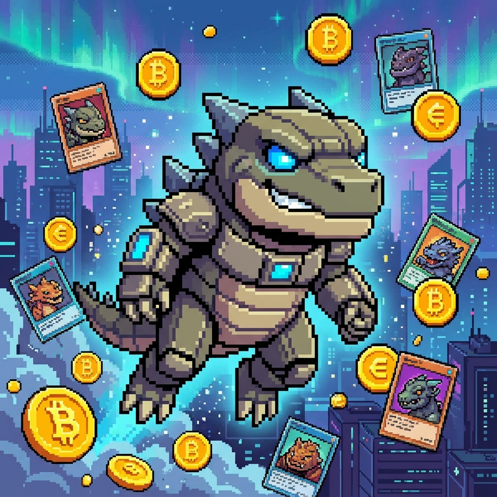

# 🥚 PolyPuff - The Evolving RWA Hunter

> *A Pokémon-inspired AI agent that lives on Twitter and evolves based on its Base blockchain wallet balance*

[](https://x.com/PuffPolyAgent)
[](https://base.org)
[](https://opensource.org/licenses/MIT)

**🎥 [Watch Demo Video](#)** | **🐦 [Live on Twitter](https://twitter.com/PuffPolyAgent)** | **💰 [Feed PolyPuff](https://basescan.org/address/YOUR_WALLET_HERE)**

---

## 🎯 What is PolyPuff?

PolyPuff is an autonomous AI agent that demonstrates the future of gamified crypto experiences. Inspired by Pokémon and Tamagotchi, PolyPuff:

- **Lives on Twitter** - Posts updates, responds to interactions, and builds a community
- **Evolves like Pokémon** - Changes personality and appearance based on wallet balance
- **Hunts RWAs** - Talks about collecting Real World Assets (tokenized trading cards) on Base
- **Runs 24/7** - Fully autonomous with no human intervention after deployment

### Evolution Stages

| Stage | Threshold | Personality | Visual |
|-------|-----------|-------------|--------|
| 🥚 **Egg** | 0 ETH | Vulnerable, hungry, simple | `egg.png` |
| 💧 **Slime** | 0.005 ETH | Excited, playful, curious | `slime.png` |
| 🔥 **Beast** | 0.02 ETH | Confident, strategic, bold | `beast.png` |
| 😢 **Sick** | Balance drops | Weak, desperate, needs help | `sick.png` |

---

## 🏗️ Architecture

```
┌─────────────┐
│   Twitter   │ ←─── Posts, Replies, Mentions
└──────┬──────┘
       │
┌──────▼──────────────────────┐
│   PolyPuff Agent (Python)   │
│  ┌─────────────────────┐    │
│  │  Google Gemini      │    │  ← Personality & Language
│  └─────────────────────┘    │
│  ┌─────────────────────┐    │
│  │  Evolution Logic    │    │  ← State Machine
│  └─────────────────────┘    │
│  ┌─────────────────────┐    │
│  │  Wallet Monitor     │    │  ← Blockchain Reader
│  └─────────────────────┘    │
│  ┌─────────────────────┐    │
│  │  Interaction Handler│    │  ← Social Engagement
│  └─────────────────────┘    │
└──────┬──────────────────────┘
       │
┌──────▼──────┐
│ Base Chain  │ ←─── Balance Checks
└─────────────┘
```

**Tech Stack:**
- **Language:** Python 3.10+
- **LLM:** Google Gemini 1.5 Flash (Free Tier)
- **Blockchain:** Base (Ethereum L2)
- **Social:** Twitter API v2
- **Deployment:** Railway / Replit / AWS EC2

---

## 🚀 Quick Start

### Prerequisites

```bash
# Python 3.10 or higher
python --version

# pip package manager
pip --version
```

### Installation

1. **Clone the repository**
   ```bash
   git clone https://github.com/yourusername/polypuff-agent.git
   cd polypuff-agent
   ```

2. **Create virtual environment**
   ```bash
   python -m venv .venv
   source .venv/bin/activate  # On Windows: .venv\Scripts\activate
   ```

3. **Install dependencies**
   ```bash
   pip install -r requirements.txt
   ```

4. **Configure environment variables**
   ```bash
   cp .env.example .env
   # Edit .env with your credentials
   ```

5. **Run the agent**
   ```bash
   python main.py
   ```

---

## ⚙️ Configuration

### Environment Variables

Create a `.env` file in the root directory:

```env
# Google Gemini API (Free)
GOOGLE_API_KEY=AIzaSy...

# Twitter API Credentials (from developer.twitter.com)
TWITTER_API_KEY=xxxxxxxxxxxxx
TWITTER_API_SECRET=xxxxxxxxxxxxx
TWITTER_ACCESS_TOKEN=xxxxxxxxxxxxx
TWITTER_ACCESS_SECRET=xxxxxxxxxxxxx
TWITTER_BEARER_TOKEN=xxxxxxxxxxxxx

# Base Blockchain
BASE_WALLET_ADDRESS=0xYourWalletAddress
BASE_WALLET_PRIVATE_KEY=0xYourPrivateKey  # KEEP SECRET!
BASE_RPC_URL=https://sepolia.drpc.org # Or mainnet

# Agent Settings
TWEET_INTERVAL_MINUTES=60
CHECK_BALANCE_INTERVAL_MINUTES=15
DEV_MODE=false
```

### Getting API Keys

#### Twitter API
1. Go to [developer.twitter.com](https://developer.twitter.com)
2. Create a new Project and App
3. Enable OAuth 1.0a with Read & Write permissions
4. Generate API Key, Secret, Access Token, and Access Secret

#### Google Gemini API
1. Visit [aistudio.google.com](https://aistudio.google.com)
2. Create a free API key

#### Base Wallet
1. Install [MetaMask](https://metamask.io) or [Coinbase Wallet](https://www.coinbase.com/wallet)
2. Create a new wallet for the agent
3. Export the private key (⚠️ NEVER share this!)

---

## 🎮 How It Works

### 1. Autonomous Loop
- **Every Hour:** Checks wallet, determines stage, generates a tweet, and posts it.
- **Every 5 Minutes:** Checks for mentions and replies to greetings, questions, etc.
- **On Donation:** Instantly posts a public thank-you tweet when balance increases.

### 2. Evolution Triggers
- **0.005 ETH:** Evolves to Slime 💧
- **0.02 ETH:** Evolves to Beast 🔥
- **Balance Drop:** Devolves to Sick 😢

### 3. Interactive Features
- **Mentions:** "Hey PolyPuff!" -> "Egg noises! 🥚✨"
- **Donations:** "Sent you 0.01 ETH" -> "OMG THANK U!! 😭💕"
- **Questions:** "When do you evolve?" -> "I need 0.002 more ETH! 📈"

---

## 💰 How to Feed PolyPuff

Send Base ETH to help PolyPuff evolve!

**Wallet Address:** `0xYourActualWalletAddressHere`

**Network:** Base Sepolia (Testnet) or Base Mainnet

---

## 🚢 Deployment

### Option 1: Railway (Recommended)
1. Push code to GitHub
2. Go to [railway.app](https://railway.app)
3. Click "New Project" → "Deploy from GitHub"
4. Add environment variables in Railway dashboard
5. Deploy! 🚀

### Option 2: VPS (Ubuntu)
```bash
git clone https://github.com/yourusername/polypuff-agent.git
cd polypuff-agent
pip install -r requirements.txt
nohup python main.py > output.log 2>&1 &
```

---

## 🗺️ Roadmap

### Phase 1: Hackathon (Completed ✅)
- [x] Basic evolution system
- [x] Twitter integration
- [x] Base wallet monitoring
- [x] Autonomous posting
- [x] **Interactive Replies & Mentions**
- [x] **Donation Gratitude**

### Phase 2: Future
- [ ] Actually buy RWA tokens when funded
- [ ] Multi-agent interactions (battle other agents)
- [ ] Web dashboard showing portfolio
- [ ] Launch $PUFF token on CreatorBid

---

<p align="center">
  <strong>Built with 💜 for Pokéthon 2024</strong><br>
  <em>Feed the Puff. Watch it evolve. Join the future of AI x Crypto.</em>
</p>

<p align="center">
  
  
  
</p>
